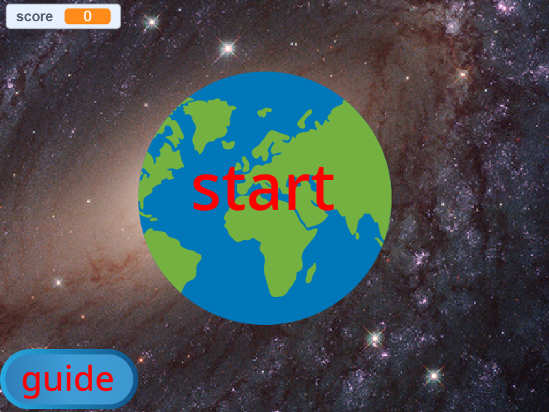
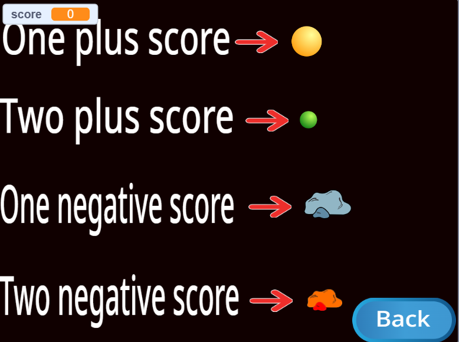
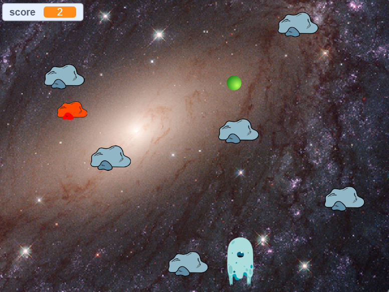

# 🌍 Earth Guardian — یک بازی اسکرچ از دوران کودکی

> یک یادگار دیجیتال؛ بازی‌ای که سال‌ها پیش با **Scratch** ساختم و حالا برای ثبت در تاریخچه‌ی مسیرم، اینجا نگهش می‌دارم.

<p align="center">
  
  
  
</p>

---

## 📖 درباره‌ی این پروژه

این بازی رو در دوران کودکی، با استفاده از **Scratch** (نرم‌افزار بلوکی برنامه‌نویسی MIT) ساختم. الان که مسیرم رو به سمت **بینایی کامپیوتر و هوش مصنوعی** ادامه می‌دم، خواستم این پروژه رو به‌عنوان اولین قدم‌های برنامه‌نویسیم اینجا آرشیو کنم — نه برای نمایش مهارت فنی امروز، بلکه برای یادآوری اینکه از کجا شروع کردم.

اگه این پروژه رو باز کنید و ببینید بلوک‌ها ساده و کدنویسی خامه، دقیقاً همینه! این یه یادگاریه، نه یه پورتفولیوی حرفه‌ای. 🙂

## 🎮 درباره‌ی بازی

یک بازی فضایی ساده که در اون یک روح (Ghost) در فضا حرکت می‌کنه و باید:

| شیء | امتیاز | توضیح |
|---|---|---|
| 🟡 توپ زرد | `+1` | جمع‌کردنش امتیاز اضافه می‌کنه |
| 🟢 توپ سبز | `+2` | امتیاز بیشتری می‌ده |
| 🪨 سنگ خاکستری | `-1` | برخورد باهاش امتیاز کم می‌کنه |
| 🟠 سنگ نارنجی | `-2` | برخورد باهاش امتیاز بیشتری کم می‌کنه |

بازی از یک **صفحه‌ی شروع** (کلیک روی کره‌ی زمین) آغاز می‌شه و یک دکمه‌ی **راهنما (guide)** هم قوانین امتیازدهی رو قبل از شروع نشون می‌ده.

## 🗂 ساختار پروژه

```
.
├── code/
│   └── Project014.sb3      # فایل اصلی پروژه‌ی Scratch
├── images/
│   ├── 1.png     # صفحه‌ی شروع
│   ├── 2.png     # صفحه‌ی راهنما
│   └── 3.png     # گیم‌پلی
└── README.md
```

> 💡 اگه اسم فولدرها یا فایل‌های شما فرق داره، فقط مسیرها رو توی این فایل مطابق پروژه‌ی خودتون اصلاح کنید.

## ▶️ چطور اجرا/بازش کنم؟

1. وارد سایت رسمی [Scratch](https://scratch.mit.edu/) بشید.
2. از منوی **File → Load from your computer** فایل `Project014.sb3` رو انتخاب کنید.
3. یا اگه فقط می‌خواید سریع تست کنید، از [Turbowarp](https://turbowarp.org/editor) هم می‌تونید استفاده کنید (فایل `.sb3` رو مستقیم بکشید و رها کنید).

## 🛠 ساخته‌شده با

- [Scratch](https://scratch.mit.edu/) — پلتفرم بلوکی MIT Media Lab برای آموزش برنامه‌نویسی به کودکان و نوجوانان

## 🙋‍♂️ درباره‌ی من امروز

الان روی **بینایی کامپیوتر (Computer Vision)** کار می‌کنم. این ریپازیتوری بیشتر جنبه‌ی حسی و یادگاری داره تا نمایش تخصص فعلیم — یه یادآوری از اولین باری که یه ایده رو تبدیل به چیزی «قابل بازی‌کردن» کردم.

---

<p align="center"><i>ساخته‌شده با کنجکاوی یک بچه، نگه‌داشته‌شده با افتخار یک مهندس. ✨</i></p>

<br>

---

---

<br>

# 🌍 Earth Guardian — A Scratch Game from Childhood

> A digital keepsake — a game I built years ago with **Scratch**, kept here as a record of where my journey began.

<p align="center">
  
  
  
</p>

---

## 📖 About This Project

I built this game as a kid using **Scratch**, MIT's block-based programming platform. Now that I'm working toward **computer vision and AI**, I wanted to archive this project here — not to showcase today's technical skill, but as a reminder of where I started.

If you open the project and find the blocks simple or the logic rough, that's exactly the point. This is a keepsake, not a professional portfolio. 🙂

## 🎮 About the Game

A simple space game where a Ghost character moves through space and must:

| Object | Score | Description |
|---|---|---|
| 🟡 Yellow ball | `+1` | Collecting it adds to your score |
| 🟢 Green ball | `+2` | Worth more points |
| 🪨 Gray rock | `-1` | Colliding with it subtracts points |
| 🟠 Orange rock | `-2` | Colliding with it costs even more |

The game begins on a **start screen** (click the Earth to begin), with a **guide** button that shows the scoring rules before you play.

## 🗂 Project Structure

```
.
├── code/
│   └── Project014.sb3      # The main Scratch project file
├── images/
│   ├── 1.png     # Start screen
│   ├── 2.png     # Guide screen
│   └── 3.png     # Gameplay
└── README.md
```

> 💡 If your folder or file names differ, just update the paths in this file to match your own structure.

## ▶️ How to Run It

1. Go to the official [Scratch](https://scratch.mit.edu/) website.
2. Use **File → Load from your computer** and select `Project014.sb3`.
3. Or, for a quick test, use [Turbowarp](https://turbowarp.org/editor) — just drag and drop the `.sb3` file.

## 🛠 Built With

- [Scratch](https://scratch.mit.edu/) — MIT Media Lab's block-based platform for teaching programming to kids and teens

## 🙋‍♂️ About Me Today

I now work on **Computer Vision**. This repository is more sentimental than technical — a reminder of the first time I turned an idea into something "playable."

---

<p align="center"><i>Built with a child's curiosity, kept with an engineer's pride. ✨</i></p>
